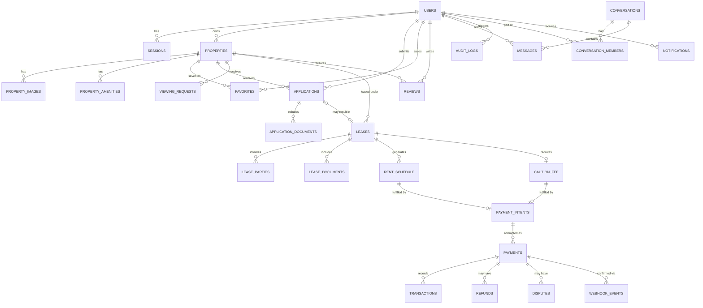

# UrbanRent — Entity Relationship Design

## 1. Diagram

## 2. Entity Notes (lifecycle-focused — columns come later)

### USERS
- Roles for v1: TENANT, LANDLORD, ADMIN (RBAC, not separate tables). AGENT deliberately excluded — no property-management-on-behalf-of-another-owner in v1, so `owner_id` on PROPERTIES is a direct, simple FK.
- Created at registration. States: `unverified → verified`, `active ↔ suspended`

### SESSIONS
- One row per refresh-token/session. Fields you'll need: token hash (never store raw), issued_at, expires_at, revoked_at, device/user-agent.
- Lifecycle: `active → rotated → revoked`

### PROPERTIES
- Created by a LANDLORD. Lifecycle: `draft → published → unpublished/archived`
- Owns child entities: images, amenities

### APPLICATIONS
- Created by a TENANT against a PROPERTY.
- Lifecycle: `submitted → under_review → approved | rejected`
- An approved application is what allows a LEASE to be created — this is your first real state-machine + business-rule pairing (a lease cannot exist without an approved application).

### VIEWING_REQUESTS
- Dynamic, request-negotiation model instead of a fixed slot inventory — matches how viewings actually get arranged locally: tenant proposes a time, landlord confirms, declines, or proposes an alternative.
- Lifecycle: `requested → confirmed | declined | rescheduled → completed | no_show`
- Note: this removes the "double-booked fixed slot" concurrency case from earlier drafts. The concurrency lesson moves elsewhere — most likely to payments (two processes trying to mark the same payment_intent as succeeded) or applications (landlord approving two applications for the same property simultaneously).

### LEASES
- Created only from an approved application.
- Lifecycle: `pending_signature → active → renewal_pending → renewed` or `active → termination_pending → terminated`
- LEASE_PARTIES exists as a join table rather than a single tenant_id column — deliberately, so a lease can later support co-tenants without a schema change.

### RENT_SCHEDULE
- Generated once a lease goes active. One row per expected payment period (e.g. monthly). This is what "overdue rent" logic reads from. Rent only — no deposit logic here.

### CAUTION_FEE
- Local term, used deliberately instead of "security deposit." Separate entity from rent because the accounting semantics differ: rent is `expected → paid → overdue`, caution fee is `collected → held → partially_applied | fully_applied | returned`.
- One per lease, collected once (typically at move-in). References the lease. If applied (e.g. damage), should reference a damage note/assessment — even a simple text field is fine for v1, doesn't need its own entity yet.

### PAYMENT_INTENTS → PAYMENTS → TRANSACTIONS / REFUNDS / DISPUTES / WEBHOOK_EVENTS
- Intent is created first (amount + purpose, before any money moves).
- Payment is the actual attempt; lifecycle: `pending → processing → succeeded | failed | cancelled`
- Transaction is the ledger record once succeeded (source of truth for accounting).
- Refunds/Disputes reference a successful payment.
- Webhook_events store raw provider payloads with a unique event ID — this is your idempotency guard (reject if event ID already processed).

### AUDIT_LOGS
- Append-only. Every sensitive mutation (approve application, change payment status, terminate lease) writes one row: who, what, when, before-state, after-state.

### CONVERSATIONS / CONVERSATION_MEMBERS / MESSAGES
- Conversation is scoped to a property + its parties (usually one landlord, one tenant). Messages reference conversation_id, sender_id, created_at.

### NOTIFICATIONS
- Generic table: user_id, type, payload (jsonb), read_at. Fed by events from applications, payments, leases, messages.

## 3. MongoDB — removed from core architecture
Property activity/event stream (viewed, favorited, searched) is NOT part of v1. PostgreSQL can handle this scale without difficulty, and introducing a second database into the live system is complexity without a corresponding need. MongoDB stays on the roadmap strictly as a later, standalone comparison exercise (build a small isolated subsystem, document the modeling differences) — it does not get wired into UrbanRent's live data flow.

## 4. Resolved decisions (locked)
1. **Agent role** — excluded from v1. Direct `owner_id` FK on PROPERTIES.
2. **Viewing scheduling** — dynamic request/confirm model (VIEWING_REQUESTS), not fixed slots.
3. **Refunds vs disputes** — separate tables, for data integrity and normalization.
4. **Caution fee** — separate entity from RENT_SCHEDULE, own lifecycle (`collected → held → partially_applied/fully_applied → returned`).

Schema is locked as of this revision. No further structural changes without a genuine architectural reason surfaced during implementation.